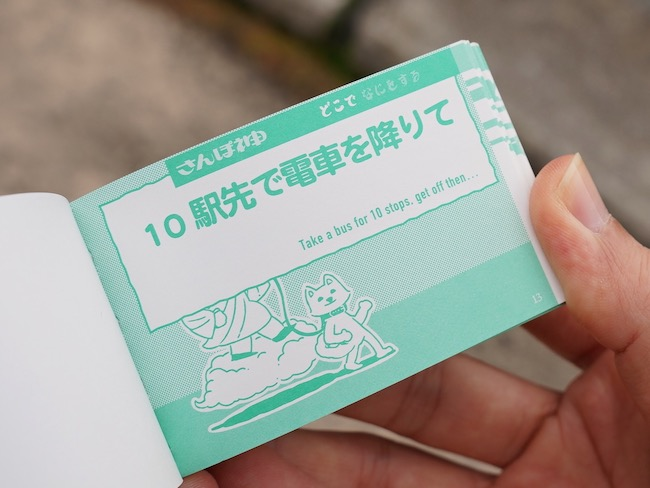
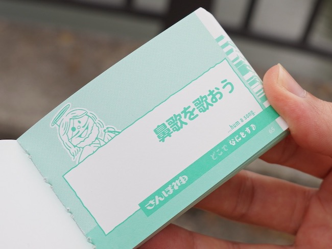

Một "cuốn sách" nhỏ dựa trên ý tưởng từ cuốn「さんぽ神」

## Động lực hay lý do cho cái này

Xem một số Youtuber Nhật làm thử thách với cuốn này thấy khá hay, mà không mua được nên ngồi tự làm ra một "cuốn sách" dựa trên ý tưởng về nó.

## Cách sử dụng

Cuốn sách bao gồm hai phần chính:

- 「どこで」- Tới đâu (Ở đâu).
    
- 「なにをする」- Làm gì.
    

Bạn cần chọn ngẫu nhiên một thẻ trong danh sách thẻ ở phần "Tới đâu" và kết hợp với một thẻ ngẫu nhiên từ danh sách "Làm gì" để thành một *nhiệm vụ* hoàn chỉnh mà bạn cần thực hiện.

Nhưng cần lưu ý là, bạn phải thực hiện phần "Tới đâu" trước, rồi sau đó mới bắt đầu chọn ngẫu nhiên một thẻ từ danh sách "Làm gì" để thực hiện.

Một số ví dụ:

- [Đi về phía một tòa nhà cao tầng] [Tìm kiếm một bức vẽ về một con vật]
- [Di chuyển ra công viên gần nhà bạn] [Nghe một bài hát thuộc thể loại nhạc mà bạn chưa nghe bao giờ]

Bạn có thể tự dùng một tệp thẻ ghi nhớ hoặc cái gì đó để làm nhé...

## Bắt đầu

| | |
| --- | --- |
| [Tới đâu](toi-dau.md) | [Làm gì](lam-gi.md) |

> [!WARNING]
>
> Phần lớn các ý tưởng được thêm bởi AI (Lấy các ý tưởng gốc trên Pinterest rồi nhờ nó sửa thêm).
> Mình vẫn chưa sửa hết đâu nha...

## Lời bạt

Chắc cũng chỉ có vậy thôi, tính làm web app nhưng nó khá là củ chuối vì đi ra ngoài tận hưởng cuộc sống mà cũng phải vác cái điện thoại đi, nên mình sẽ viết thẻ bằng giấy rồi bốc tay thôi....

